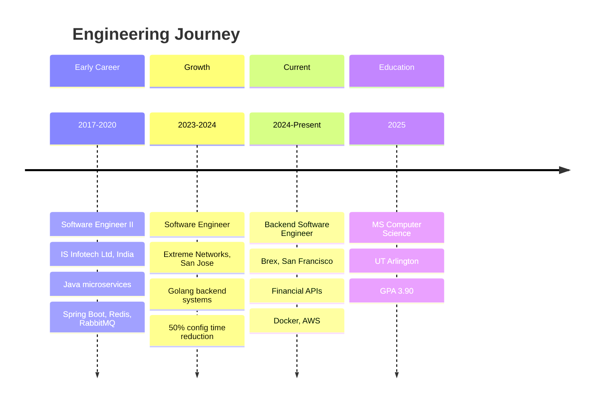
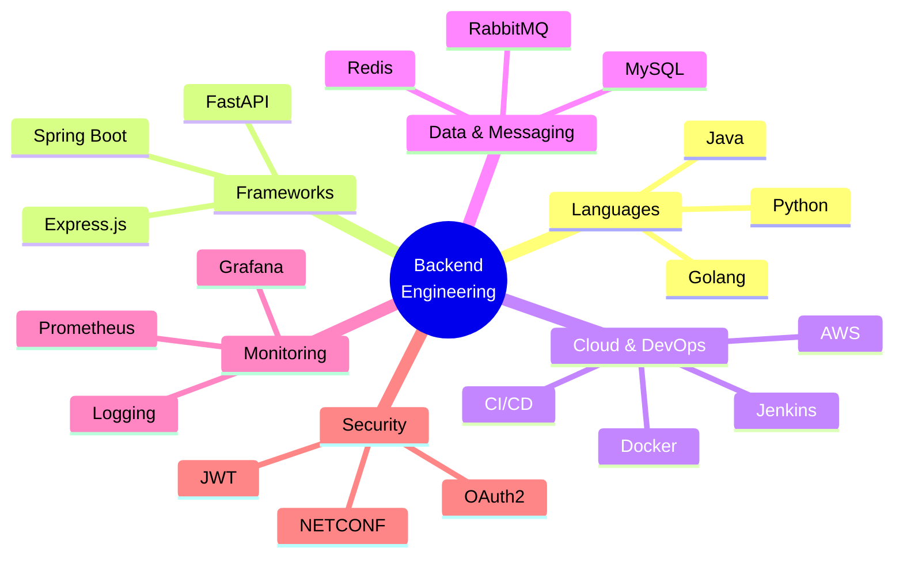

<div align="center">
  
</div>

<div align="center">

### Backend Software Engineer | Passionate about building reliable, scalable systems

[](mailto:akshayb220194@gmail.com)
[](https://akshaybasavalingaiah.us)
[](https://www.google.com/maps/place/California)

</div>

---

## About Me

I'm a backend software engineer with hands-on experience building APIs, microservices, and data pipelines across fintech, enterprise networking, and healthcare domains. I enjoy solving real-world problems with clean code, writing tests that matter, and learning new tools along the way.

Currently pursuing my **MS in Computer Science at UT Arlington (GPA: 3.90)** while working at **Brex** on backend services that power financial workflows.

---

## Work Experience

```
BREX                     Backend Software Engineer       Feb 2024 - Present
  - Building and optimizing backend APIs for high-volume financial transactions
  - Working with Docker, AWS, and observability tools (logging, monitoring, alerting)
  - Collaborating with cross-functional teams to ship features faster

EXTREME NETWORKS         Software Engineer               Jun 2023 - Jan 2024
  - Built a Golang monitoring module that cut device configuration time by 50%
  - Created concurrent telemetry pipelines using goroutines (35% throughput gain)
  - Automated network provisioning with NETCONF/XML, reducing manual setup by 30%
  - Integrated services into Docker-based CI/CD pipelines

IS INFOTECH LTD          Software Engineer II            Apr 2017 - Nov 2020
  - Developed Java microservices with Spring Boot for healthcare applications
  - Optimized REST APIs with Redis caching (40% faster response times)
  - Implemented JWT/OAuth2 authentication for secure data handling
  - Built async workflows with RabbitMQ and set up Prometheus/Grafana monitoring
  - Wrote unit tests with JUnit/MockMvc, reaching 90% code coverage
```

---

## Career Timeline



---

## Tech Stack



<div align="center">

| Domain | Technologies |
|:------:|:------------|
| **Languages** | Golang, Java, Python |
| **Frameworks** | Spring Boot, FastAPI, Express.js |
| **Databases & Caching** | MySQL, Redis, RabbitMQ, SQLite |
| **Cloud & DevOps** | AWS, Docker, Jenkins, CI/CD |
| **Monitoring** | Prometheus, Grafana, logging/alerting |
| **Security** | JWT, OAuth2, NETCONF |
| **Testing** | JUnit, MockMvc, integration testing |
| **Other** | Git, Agile/Scrum, REST APIs, microservices |

</div>

---

## Featured Projects

### Credit Card Fraud Detection (MLOps)
End-to-end ML pipeline with Flask, XGBoost, and LangChain-powered explanations. Containerized with Docker, data versioned with DVC.

**Stack**: Python, Flask, XGBoost, Docker, DVC, LangChain

### Email Phishing Detection
Multi-layered email analyzer that checks SPF/DKIM/DMARC headers, scans attachments with OCR, queries VirusTotal, and produces AI-powered phishing scores.

**Stack**: Python, VirusTotal API, Tesseract OCR, SQLite

### Stockastic - Stock Price Prediction
Streamlit app for stock forecasting using ARIMA models, real-time data from YFinance, and interactive Plotly charts.

**Stack**: Python, Streamlit, StatsModels, YFinance, Plotly

### SocialEcho - Social Network with Content Moderation
MERN stack social platform with automated NLP-based content moderation using Perspective API and Hugging Face models.

**Stack**: React, Node.js, MongoDB, Flask, Hugging Face

### JWT Auth REST API
TypeScript REST API starter with JWT authentication, role-based authorization, Express.js, and TypeORM.

**Stack**: TypeScript, Express.js, TypeORM, SQLite

---

## Education

| Degree | School | GPA | Year |
|:------:|:-------|:---:|:----:|
| **MS Computer Science** | University of Texas at Arlington | 3.90/4.0 | 2025 |
| **BE Electronics & Communication** | Visvesvaraya Technological University, India | 3.60/4.0 | 2017 |

---

## GitHub Stats

<div align="center">


</div>

### Languages & Tools I Work With

```text
Golang         ███████████████████░░   90%
Java           ██████████████████░░░   85%
Python         █████████████████░░░░   80%
TypeScript     ████████████░░░░░░░░░   55%
SQL            ██████████████░░░░░░░   65%
Docker         ████████████████░░░░░   75%
AWS            █████████████░░░░░░░░   60%
```

<div align="center">

</div>

---

## What I'm Looking For

I'm looking for **backend software engineer roles** where I can contribute to building reliable systems, learn from experienced engineers, and grow my skills in distributed systems and cloud infrastructure. I'm especially interested in teams that value clean code, good testing practices, and collaborative development.

---

<div align="center">

**Open to backend engineering opportunities. Let's connect!**


</div>
