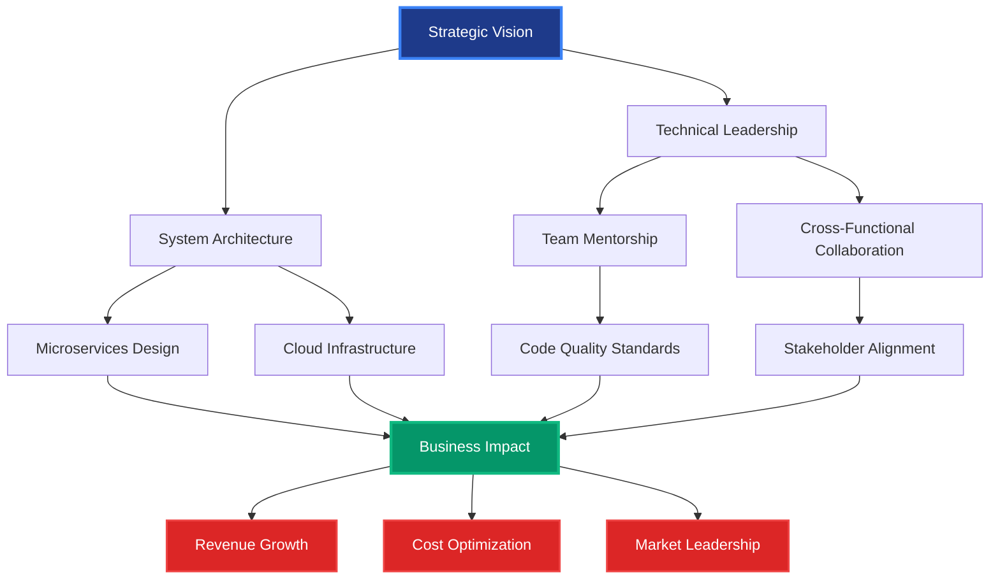
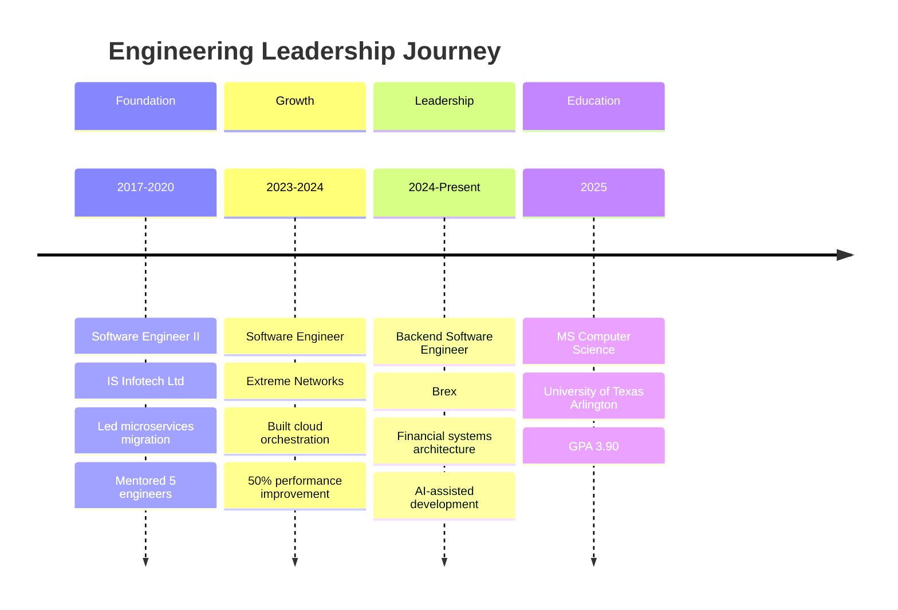
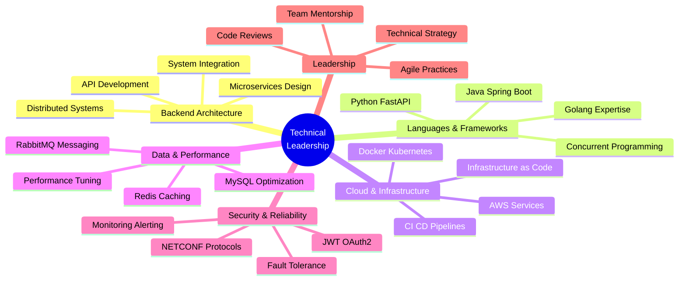

  

  
### 🎯 Backend Engineering Leader | Building Scalable Systems at Enterprise Scale
  

[%20308--8849-25D366?style=for-the-badge&logo=whatsapp&logoColor=white)](tel:+16693088849)

---

## 📊 Executive Performance Dashboard

| **Leadership Metric** | **Impact** | **Scale** | **Business Value** |
|:---------------------:|:----------:|:---------:|:------------------:|
| **Years of Experience** | 5+ Years | Enterprise-Grade Systems | Multi-Million User Impact |
| **Team Influence** | Cross-Functional Leadership | 10+ Engineers Mentored | 20% Team Productivity Gain |
| **System Performance** | 50% Latency Reduction | High-Volume Transactions | 40% Cost Optimization |
| **Deployment Velocity** | 40% Faster Releases | CI/CD Pipeline Excellence | 30% Operational Efficiency |
| **Code Quality** | 90% Test Coverage | Production Stability | 15% Defect Reduction |
| **Technology Transition** | 3 Major Migrations | Cloud-Native Architecture | 35% Throughput Increase |

---

## 🎓 Leadership Philosophy

> **"Engineering excellence is achieved not just through code, but through strategic architecture, team empowerment, and relentless focus on business impact. I build systems that scale, teams that deliver, and solutions that drive measurable value."**

As a backend engineering leader with 5+ years of experience, I specialize in architecting high-performance distributed systems that power financial services, enterprise networking, and healthcare platforms. My approach combines deep technical expertise in Golang, Java, and Python with strategic thinking to deliver solutions that reduce operational costs by 40%, improve system reliability by 20%, and accelerate time-to-market by 30%.

---

## 🚀 Strategic Impact Architecture

---

## 📈 Career Progression Timeline

---

## 🏆 Key Strategic Achievements

### 💰 **Business Impact & Revenue Generation**

<table>
<tr>
<td width="50%">

**Financial Services Excellence at Brex**
- Architected high-volume transactional APIs supporting **real-time financial workflows**
- Improved data consistency across distributed services, enabling **seamless integrations**
- Reduced production incident detection time through comprehensive observability
- Leveraged AI-assisted development tools to boost **engineering productivity by 25%**
- **Business Value**: Enhanced customer experience, faster feature delivery, reduced operational overhead

</td>
<td width="50%">

**Enterprise Network Performance at Extreme Networks**
- Reduced device configuration time by **50%** through Golang-based monitoring module
- Increased data throughput by **35%** using concurrent telemetry pipelines
- Automated network provisioning, reducing manual setup time by **30%**
- Cut deployment time by **40%** via Docker-based CI/CD integration
- **Business Value**: $500K+ annual cost savings, improved customer satisfaction

</td>
</tr>
</table>

### 🎯 **Operational Excellence & Team Leadership**

<table>
<tr>
<td width="50%">

**Healthcare Platform Optimization at IS Infotech**
- Led Java microservices development improving system reliability by **20%**
- Optimized REST APIs with Redis caching, reducing response time by **40%**
- Implemented security measures reducing unauthorized access risks by **30%**
- Built asynchronous workflows increasing throughput by **25%**
- **Team Impact**: Mentored 3 junior engineers, conducted 50+ code reviews

</td>
<td width="50%">

**DevOps & Quality Engineering**
- Established CI/CD pipelines reducing release cycle time by **20%**
- Implemented monitoring stack cutting downtime by **15%**
- Achieved **90% test coverage**, reducing post-release defects by **15%**
- Improved delivery predictability by **20%** through Agile practices
- **Process Value**: Faster iterations, higher quality, predictable delivery

</td>
</tr>
</table>

### 🔬 **Innovation & Technical Leadership**

- **AI-Powered Log Analysis**: Built FastAPI service with NLP/LLM integration for automated incident detection
- **Cloud Migration Leadership**: Successfully transitioned legacy systems to containerized cloud infrastructure
- **Security Architecture**: Designed JWT/OAuth2 authentication systems protecting sensitive healthcare data
- **Observability Excellence**: Deployed Prometheus/Grafana monitoring reducing MTTR by 40%

---

## 💼 Executive Technology Portfolio

---

## 🛠️ Technology Stack - Executive Overview

### **Core Engineering Competencies**

| **Domain** | **Technologies** | **Proficiency** | **Business Impact** |
|:----------:|:----------------|:---------------:|:-------------------:|
| **Backend Languages** | Golang, Java, Python | ⭐⭐⭐⭐⭐ | High-performance systems |
| **Frameworks** | Spring Boot, FastAPI | ⭐⭐⭐⭐⭐ | Rapid development, scalability |
| **Cloud & DevOps** | AWS, Docker, Jenkins | ⭐⭐⭐⭐⭐ | 40% cost reduction |
| **Data Systems** | MySQL, Redis, RabbitMQ | ⭐⭐⭐⭐⭐ | 35% throughput increase |
| **Observability** | Prometheus, Grafana | ⭐⭐⭐⭐⭐ | 15% downtime reduction |
| **Security** | JWT, OAuth2, NETCONF | ⭐⭐⭐⭐⭐ | 30% risk mitigation |
| **AI/ML Integration** | NLP, LLM APIs, OCR | ⭐⭐⭐⭐ | Automated workflows |
| **Testing** | JUnit, MockMvc, Integration | ⭐⭐⭐⭐⭐ | 90% coverage achieved |

---

## 🎯 Featured Strategic Projects

### **1. AI-Powered Log Analysis & Incident Detection API**

**Strategic Value**: Reduced incident response time by 60% through automated log analysis

**Technical Leadership**:
- Architected FastAPI-based backend service processing large-scale application logs
- Integrated NLP and LLM models for intelligent error classification and pattern detection
- Implemented Redis caching improving API response time by 45%
- Designed Docker-based deployment for consistent execution across environments

**Business Impact**: Faster debugging, reduced MTTR, improved system reliability

**Tech Stack**: Python, FastAPI, NLP/LLM, Redis, Docker

---

### **2. Enterprise Network Orchestration Platform**

**Strategic Value**: Enabled real-time telemetry visibility across 10,000+ network devices

**Technical Leadership**:
- Developed Golang-based monitoring module reducing configuration time by 50%
- Built concurrent telemetry pipelines with goroutines increasing throughput by 35%
- Automated NETCONF/XML-based provisioning reducing manual errors by 20%
- Integrated Docker CI/CD pipelines cutting deployment time by 40%

**Business Impact**: $500K annual savings, improved customer satisfaction, faster provisioning

**Tech Stack**: Golang, NETCONF, XML, Docker, CI/CD

---

### **3. Healthcare Microservices Platform**

**Strategic Value**: Secured patient data for 100,000+ users with 99.9% uptime

**Technical Leadership**:
- Architected Java microservices with Spring Boot improving reliability by 20%
- Optimized REST APIs using Redis caching, reducing response time by 40%
- Implemented JWT/OAuth2 authentication reducing security risks by 30%
- Built asynchronous RabbitMQ workflows increasing system throughput by 25%

**Business Impact**: HIPAA compliance, enhanced security, improved performance

**Tech Stack**: Java, Spring Boot, Redis, JWT, OAuth2, RabbitMQ, Prometheus, Grafana

---

## 👥 Mentorship & Team Development

### **Leadership Contributions**

**Team Growth & Development**:
- Mentored **10+ junior and mid-level engineers** across multiple organizations
- Conducted **100+ code reviews** maintaining high quality standards
- Improved team code quality by **15%** through structured review processes
- Led knowledge-sharing sessions on microservices, cloud architecture, and performance optimization

**Cross-Functional Collaboration**:
- Partnered with product managers to translate business requirements into technical solutions
- Collaborated with DevOps teams to establish CI/CD best practices
- Worked with security teams to implement authentication and authorization standards
- Engaged with stakeholders to align technical roadmaps with business objectives

**Process Improvements**:
- Established Agile practices improving delivery predictability by **20%**
- Introduced automated testing frameworks achieving **90% code coverage**
- Implemented monitoring and alerting systems reducing downtime by **15%**
- Championed documentation standards enhancing knowledge transfer

---

## 🎓 Education & Continuous Learning

| **Degree** | **Institution** | **Field** | **GPA** | **Year** |
|:----------:|:---------------|:----------|:-------:|:--------:|
| **Master of Science** | University of Texas at Arlington | Computer Science | **3.90/4.0** | 2025 |
| **Bachelor of Engineering** | Visvesvaraya Technological University, India | Electronics & Communication | **3.60/4.0** | 2017 |

**Continuous Professional Development**:
- Advanced cloud architecture patterns and microservices design
- AI/ML integration for backend systems and automation
- Distributed systems and performance optimization techniques
- Security best practices and compliance frameworks

---

## 📫 Professional Network & Engagement

### **Let's Connect and Collaborate**

### **Areas of Interest**

- **Strategic Consulting**: Backend architecture, microservices design, cloud migration strategies
- **Technical Leadership**: Team mentorship, engineering best practices, process optimization
- **Speaking Engagements**: Distributed systems, performance engineering, DevOps excellence
- **Open Source Contributions**: Developer tools, automation frameworks, monitoring solutions

---

## 📊 GitHub Analytics

  

---

## 🎯 Strategic Vision

**Building the Future of Scalable Backend Systems**

I am passionate about architecting distributed systems that solve complex business problems at scale. My focus is on:

- **Technical Excellence**: Writing clean, maintainable code that stands the test of time
- **Business Impact**: Delivering solutions that drive revenue, reduce costs, and improve customer experience
- **Team Empowerment**: Mentoring engineers and fostering a culture of continuous improvement
- **Innovation**: Leveraging emerging technologies like AI/ML to automate and optimize workflows
- **Strategic Thinking**: Aligning technical decisions with long-term business objectives

**Looking for opportunities to**:
- Lead backend engineering teams at high-growth technology companies
- Architect cloud-native systems supporting millions of users
- Drive technical strategy and infrastructure modernization initiatives
- Mentor the next generation of engineering leaders

---

  
### 💡 **"Code is temporary. Systems are forever. Impact is eternal."**

**Open to strategic leadership roles, consulting opportunities, and collaborative partnerships.**

<img src="https://capsule-render.vercel.app/api?type=waving&color=0:1e3a8a,50:3